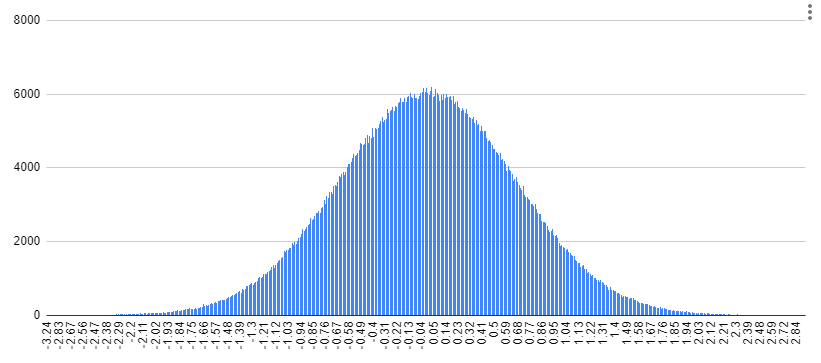

[comment]: # (controls: true)
[comment]: # (keyboard: true)
[comment]: # (markdown: { smartypants: true })
[comment]: # (hash: false)
[comment]: # (respondToHashChanges: false)


<code style="color:#0eb9a3;">dbt_synth_data</code><br />
<small>a `dbt` package for creating synthetic data</small>

<hr style="border-width:1px 0 0 0;" />

<!-- <strong>Tom Reitz</strong> &nbsp; &nbsp;  -->
<div style="font-size:26px; line-height:56px;">Data Engineering @ </div>


[comment]: # (!!! data-auto-animate)

Two approaches for creating fake data

[comment]: # (||| data-auto-animate)


de-identify real data &rarr; possibly "fuzz" some values

<em>can be suscpetible to re-identification</em>  <!-- .element: class="fragment" data-fragment-index="2" -->

[comment]: # (||| data-auto-animate)


start with nothing &rarr; synthesize data by describing it

<em>safer, but more work</em>  <!-- .element: class="fragment" data-fragment-index="2" -->

<div>&uarr; <code style="color:#0eb9a3;">dbt_synth_data</code> does this</div>  <!-- .element: class="fragment" data-fragment-index="3" -->


[comment]: # (!!! data-auto-animate)

### motivation

Other tools ([Faker](https://faker.readthedocs.io/en/master/) for Python, [Mimesis](https://mimesis.name/en/master/) for Postgres) exist for creating synthetic data... why build another?

* **cross-platform:** write code once, run on<br />Snowflake, Postgres, SQLite...
* **performance:** creating 100B rows with Faker takes months, Snowflake can do it in ~1 hour


[comment]: # (!!! data-auto-animate)

### how it works

[comment]: # (||| data-auto-animate)

most SQL flavors can `generate()` rows:

```sql
-- Snowflake:
select
	row_number() over (order by 1) as rownum
from table(generator( rowcount => 100 ));

-- Postgres:
select
	s.rownum as rownum
from generate_series( 1, 100 ) as s(rownum);
```

[comment]: # (||| data-auto-animate)

produces...

| rownum |
|---|
| 1 |
| 2 |
| 3 |
| ⋮ |
| 100 |

[comment]: # (||| data-auto-animate)

most SQL flavors can generate `random()` numbers:

```sql
-- Snowflake:
select random();
--> int between -BIGINT_MIN : +BIGINT_MAX
select uniform(0::float, 1::float, random());
--> float between 0.0 : 1.0

-- Postgres
select random();
--> float between 0.0 : 1.0
```

[comment]: # (||| data-auto-animate)

put these together to generate rows of randomness:

```sql
-- Snowflake:
select
	row_number() over (order by 1) as rownum,
  uniform(0::float, 1::float, random()) as randval
from table(generator( rowcount => 100 ));

-- Postgres:
select
	s.idx as rownum,
  random() as randval
from generate_series( 1, {{rows}} ) as s(idx);
```

[comment]: # (||| data-auto-animate)

produces...

| rownum | randval |
|---|---|
| 1 | 0.01736233267 |
| 2 | 0.8667546837 |
| 3 | 0.4433875307 |
| ⋮ | ⋮ |

[comment]: # (||| data-auto-animate)

other (non-uniform) distributions are possible too

[comment]: # (||| data-auto-animate)

normal distribution:

``` sql
-- Snowflake:
select
	row_number() over (order by 1) as rownum,
  normal(1::float, 1::float, random()) as normal_randval
  --     ^ mean    ^ stddev  ^ rand
from table(generator( rowcount => 100 ));

-- Postgres:
select
	s.idx as rownum,
  ( ( 1.0 * sqrt(-2*log(random()))*sin(2*pi()*random()) ) + 1.0 ) as normal_randval
  --  ^ stddev          ^ rand 1              ^ rand 2      ^ mean
from generate_series( 1, {{rows}} ) as s(idx);
```

[comment]: # (||| data-auto-animate)

exponential distribution:

``` sql
-- Snowflake:
select
	row_number() over (order by 1) as rownum,
  -ln( abs ( uniform(0::float, 1::float, random()) ) ) * (1/1.0) as exp_randval
  --         ^ uniform rand                                 ^ lambda
from table(generator( rowcount => 100 ));
```


[comment]: # (!!! data-auto-animate)


precise syntax varies by SQL flavor

[comment]: # (||| data-auto-animate)


dbt to the rescue

[comment]: # (||| data-auto-animate)

<b>dbt</b> (data build tool)
* used extensively by EA's data engineering team,<br />and by data engineers generally
* compiles and runs SQL
* allows for abstraction, writing macros (functions) that produce SQL
* abstract across different SQL flavors/engines

[comment]: # (||| data-auto-animate)

example:
```sql
{{ synth_distribution_continuous_normal(mean=0, stddev=1) }}
```
compiles to
```
normal(0.0::float, 1.0::float, random())
-- when run on Snowflake

(
  (
    1.0::float
    * sqrt( -2 * log( random() ) )
    * sin( 2 * pi() * random() ) 
  ) + 0.0::float
) -- when run on Postgres
```

[comment]: # (||| data-auto-animate)



<small>(histogram with 1M values)</small>


[comment]: # (!!! data-auto-animate)

how it works
