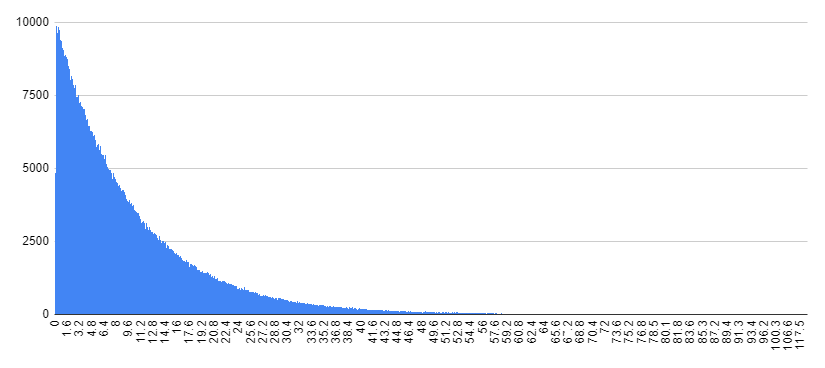
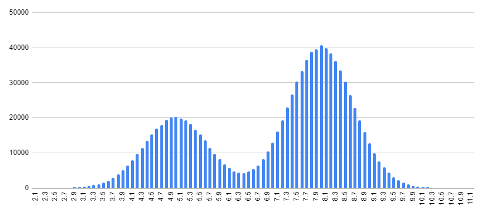
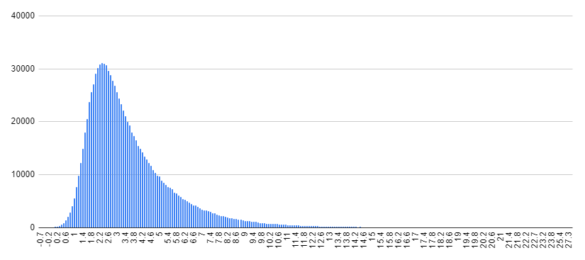
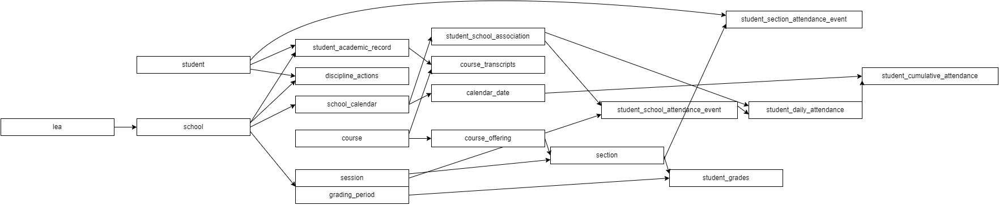
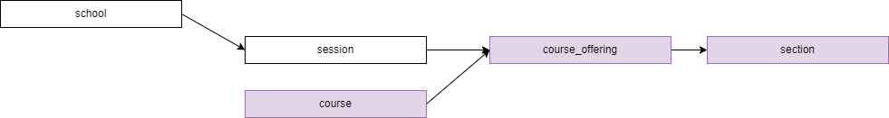
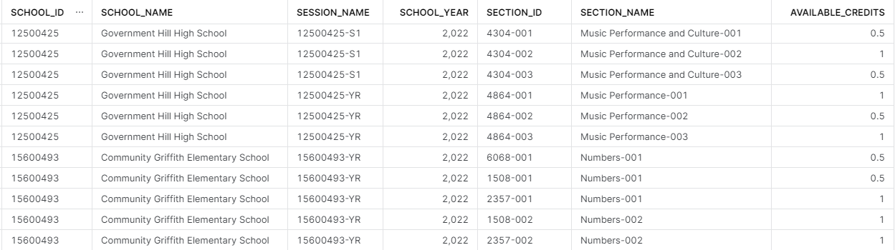

[comment]: # (controls: true)
[comment]: # (keyboard: true)
[comment]: # (markdown: { smartypants: true })
[comment]: # (hash: false)
[comment]: # (respondToHashChanges: false)


<code style="color:#0eb9a3;">dbt_synth_data</code><br />
<small>a `dbt` package for creating synthetic data</small>

<hr style="border-width:1px 0 0 0;" />

<!-- <strong>Tom Reitz</strong> &nbsp; &nbsp;  -->
<div style="font-size:26px; line-height:56px;">Data Engineering @ </div>


[comment]: # (!!! data-auto-animate)

### Approach

<br />

Two main methods for creating fake data

[comment]: # (||| data-auto-animate)


de-identify real data

possibly "fuzz" some values  <!-- .element: class="fragment" data-fragment-index="2" -->

<em>⚠️ can be susceptible to re-identification</em>  <!-- .element: class="fragment" data-fragment-index="3" -->

[comment]: # (||| data-auto-animate)


start with nothing

synthesize data by describing it  <!-- .element: class="fragment" data-fragment-index="2" -->

<em>👍 safer, but more work</em>  <!-- .element: class="fragment" data-fragment-index="3" -->

<div>&uarr; <code style="color:#0eb9a3;">dbt_synth_data</code> does this</div>  <!-- .element: class="fragment" data-fragment-index="3" -->


[comment]: # (!!! data-auto-animate)

### motivation

Other tools ([Faker](https://faker.readthedocs.io/en/master/) for Python, [Mimesis](https://mimesis.name/en/master/) for Postgres) exist for creating synthetic data... why build another?

* **cross-platform:** write code once, run on<br />Snowflake, Postgres, SQLite...
* **performance:** Faker: 10 min for 100K rows; Snowflake: 1.2 hrs for 10B rows


[comment]: # (!!! data-auto-animate)

### how it works

[comment]: # (||| data-auto-animate)

💡 &nbsp; most SQL dialects can `generate()` rows:

```sql
-- Snowflake:
select
  row_number() over (order by 1) as rownum
from table(generator( rowcount => 100 ));

-- Postgres:
select
  s.rownum as rownum
from generate_series( 1, 100 ) as s(rownum);
```

[comment]: # (||| data-auto-animate)

produces...

| rownum |
|---|
| 1 |
| 2 |
| 3 |
| ⋮ |
| 100 |

[comment]: # (||| data-auto-animate)

💡 &nbsp; most SQL dialects can generate `random()` numbers:

```sql
-- Snowflake:
select random();
--> int between -BIGINT_MIN : +BIGINT_MAX
select uniform(0::float, 1::float, random());
--> float between 0.0 : 1.0

-- Postgres:
select random();
--> float between 0.0 : 1.0
```

[comment]: # (||| data-auto-animate)

💡<sup>2</sup> &nbsp; put together, generate rows of randomness:

```sql
-- Snowflake:
select
  row_number() over (order by 1) as rownum,
  uniform(0::float, 1::float, random()) as randval
from table(generator( rowcount => 100 ))

-- Postgres:
select
  s.idx as rownum,
  random() as randval
from generate_series( 1, 100 ) as s(idx)
```

[comment]: # (||| data-auto-animate)

produces...

| rownum | randval |
|---|---|
| 1 | 0.01736233267 |
| 2 | 0.8667546837 |
| 3 | 0.4433875307 |
| ⋮ | ⋮ |

yay!

[comment]: # (||| data-auto-animate)

📍 (non-uniform distributions are possible too)


[comment]: # (!!! data-auto-animate)

### Challenges

[comment]: # (||| data-auto-animate)

precise syntax varies by SQL dialect


[comment]: # (||| data-auto-animate)


**dbt** to the rescue

[comment]: # (||| data-auto-animate)

**dbt** (data build tool)
* used extensively by EA's data engineering team,<br />and by data engineers generally
* compiles and runs SQL
* write macros (functions) that produce SQL
* abstract across different SQL dialects

[comment]: # (||| data-auto-animate)

```sql
{{ synth_distribution_continuous_uniform(min=0.0, max=10.0) }}
```
compiles to
```
uniform(0.0::float, 10.0::float, random())
-- when run on Snowflake

(10.0 - 0.0) * random() ) + 0.0
-- when run on Postgres
```


[comment]: # (||| data-auto-animate)

<code style="color:#0eb9a3;">dbt_synth_data</code> uses CTEs<br />(common table expressions)<br />extensively to deal with two problems:

[comment]: # (||| data-auto-animate)

**problem 1:** SQL engines "optimize away"<br />randomness inside subqueries


[comment]: # (||| data-auto-animate)

<div style="font-size:90%;">

```sql [5-8]
-- grab 100 random schools by id
select
  ceil(uniform(100::float, 500::float, random())) as rand_school_id,
  (
    select k_school
    from db.schema.dim_school
    where school_id=ceil(uniform(100::float, 500::float, random()))
    limit 1
  ) as k_school
from table(generator( rowcount => 100 ))
```

</div>

optimizer runs inner subquery once,<br />result reused for every row of outer query!

[comment]: # (||| data-auto-animate)

produces...

| rand_school_id | k_school |
|---|---|
| 165 | f8de717cfb7ed59631852d1c7f63bc70 |
| 456 | f8de717cfb7ed59631852d1c7f63bc70 |
| 339 | f8de717cfb7ed59631852d1c7f63bc70 |
| ⋮ | ⋮ |

oops!

[comment]: # (||| data-auto-animate)

CTEs fix this:

<div style="font-size:90%;">

```sql
-- grab 100 random schools by id
with dim_school as (
  select school_id, k_school
  from db.schema.dim_school
),
base as (
  select
    ceil(uniform(100::float, 500::float, random())) as rand_school_id
  from table(generator( rowcount => 100 ))
)
select base.*, dim_school.k_school
from base
  join dim_school on base.rand_school_id=dim_school.school_id
```

</div>

[comment]: # (||| data-auto-animate)

produces...

| rand_school_id | k_school |
|---|---|
| 474 | 23bd8cc78d10d8a3f6a9ec35caa38d33 |
| 171 | 80ed1896bc0fed93d078ac5126181f3d |
| 256 | 7b96ed1ecf4d0f6ff41ee65f698e7d69 |
| ⋮ | ⋮ |

much better

[comment]: # (||| data-auto-animate)

**problem 2**: *some* SQL dialects<br />don't suppoprt column reuse

[comment]: # (||| data-auto-animate)

```sql
select
  ceil(uniform(0::float, 10::float, random())) as randint,
  5 * randint as multint
from table(generator( rowcount => 100 ))
-- works in Snowflake, but not Postgres :(
```

[comment]: # (||| data-auto-animate)

CTEs fix this:
```sql
with step1 as (
  select
    ceil(uniform(0::float, 10::float, random())) as randint
  from table(generator( rowcount => 100 ))
),
step2 as (
  select
    randint,
    5 * randint as multint
  from step1
)
select * from step2
```

[comment]: # (!!! data-auto-animate)

### Features

<code style="color:#0eb9a3;">dbt_synth_data</code> puts all of this together:
* implements cross-platform macros
* can construct complex distributions
* provides many types of columns
* provides seed data for names, cities, and more

[comment]: # (||| data-auto-animate)

```
{{ synth_distribution_continuous_normal(mean=0.0, stddev=1.0) }}
```


<small>(histogram with 1M values)</small>

[comment]: # (||| data-auto-animate)

```
{{ synth_distribution_continuous_exponential(lambda=0.1) }}
```



<small>(histogram with 1M values)</small>

[comment]: # (||| data-auto-animate)

```
{{ synth_distribution_union(
  synth_distribution_continuous_normal(mean=5.0, stddev=1.0),
  synth_distribution_continuous_normal(mean=8.0, stddev=1.0),
  weights=[1, 2]
) }}
```



<small>(histogram with 1M values)</small>

[comment]: # (||| data-auto-animate)

```
{{ synth_distribution_average(
  synth_distribution_continuous_exponential(lambda=0.1),
  synth_distribution_continuous_normal(mean=2.0, stddev=1.0),
  weights=[1,4]
) }}
```



<small>(histogram with 1M values)</small>

[comment]: # (||| data-auto-animate)

<code style="color:#0eb9a3;">dbt_synth_data</code> provides many column types

<div style="font-size:75%;">

* **basic:** boolean, int, int_sequence, numeric, date, date_sequence, primary_key, string, value, expression, mapping, values
* **statistical:** distribution, correlation
* **referential:** foreign_key, lookup, select
* **data:** word, words, firstname, lastname, language, country, geo_region, city
* **composite:** address, phone_number

see [docs](https://github.com/edanalytics/dbt_synth_data/#column-types) for full syntax and examples

[comment]: # (||| data-auto-animate)

dim_customer:

<div style="font-size:75%;">

```sql
with
{{ synth_column_primary_key(name='k_customer') }}
{{ synth_column_firstname(name='first_name') }}
{{ synth_column_lastname(name='last_name') }}
{{ synth_column_expression(name='full_name', expression="first_name || ' ' || last_name") }}
{{ synth_column_expression(name='sort_name', expression="last_name || ', ' || first_name") }}
{{ synth_column_date(name='birth_date', min='1938-01-01', max='1994-12-31') }}
{{ synth_column_address(name='shipping_address', countries=['United States'],
  parts=['street_address', 'city', 'geo_region_abbr', 'postal_code']) }}
{{ synth_column_phone_number(name='phone_number') }}
{{ synth_table(rows=100000) }}
select * from synth_table
```

(compiles into a list of CTEs that build up synthetic data)
</div>

[comment]: # (||| data-auto-animate)

produces...

<div style="font-size:33%;">

| k_customer | first_name | last_name | full_name | sort_name | birth_date | shipping_address | phone_number |
|---|---|---|---|---|---|---|---|
| 1de0...059a | Lucio | Ferguson | Lucio Ferguson | Ferguson, Lucio | 1986-04-24 | 3474 Plenty Ordinary Dr., Bryan, WI 93117 | (293) 959-0612 |
| d1be...ae12 | Lon | Cherry | Lon Cherry | Cherry, Lon | 1954-08-22 | 1752 Consumer Ln. #11, Columbus, SC 895 | (498) 173-0332 |
| c33b...0ef5 | Laverne | Villa | Laverne Villa | Villa, Laverne | 1951-07-13 | PO Box 514, Fremont, CA 20052 | (462) 191-0042 |
| 655a...79c9 | Carly | Ayala | Carly Ayala | Ayala, Carly | 1944-09-16 | 9684 Buildings Rd. #447, The Bronx, OR 81518 | (542) 746-0487 |
| 237a...57c7 | Tamika | Morales | Tamika Morales | Morales, Tamika | 1993-12-04 | 8666 Beauty Blvd. No. 748, Plymouth, AR 90491 | (961) 212-0923 |
| ⋮ | ⋮ | ⋮ | ⋮ | ⋮ | ⋮ | ⋮ | ⋮ |

</div>

[comment]: # (!!! data-auto-animate)

### performance

[comment]: # (||| data-auto-animate)

e-commerce store on xsmall Snowflake warehouse

<div style="font-size:75%;">

| table | rows | cols | run time | data size |
|---|---|---|---|---|
| **customers** | 1M | 8 | ~20 secs | 53.0 MB |
| **products** | 50k | 3 | ~20 secs | 2.4 MB |
| **stores** | 20k | 5 cols | ~2 secs | 1.3 MB |
| **orders** | 50M | 4 | ~2 hrs | 1.0 GB |
| **inventory** | 100M | 4 | ~5.5 hrs | 2.5 GB |

</div>

[comment]: # (||| data-auto-animate)

various distributions on xsmall Snowflake warehouse

<div style="font-size:75%;">

| table | rows | cols | run time | data size |
|---|---|---|---|---|
| **distributions** | 10B | 15 | 81 min | 614.7 GB |

</div>

[comment]: # (!!! data-auto-animate)

### usage

<div style="font-size:75%;">

we are using <code style="color:#0eb9a3;">dbt_synth_data</code> to build<br /><code style="color:#0eb9a3;">edu_edfi_source_synth</code>: synthetic education data<br />which can feed into Stadium/EDU and Podium

(useful for demos, training, development)

</div>

[comment]: # (||| data-auto-animate)




<small>(<code style="color:#0eb9a3;">edu_edfi_source_synth</code> model dependency graph)</small>

[comment]: # (||| data-auto-animate)




<small>We had to first create the universe of **Courses**, then **Course Offerings**, then **Sections**, so that their relationships mirror a realistic school system.</small>


[comment]: # (||| data-auto-animate)




<small>Here's an example query output from the synthetic Ed-fi warehouse!</small>


[comment]: # (!!! data-auto-animate)

### thank you
Any Questions?
